# Tübingen 2026 — Análisis prosódico del habla con APH, Etiquetador oral y Oralstats

Materiales de **Adrián Cabedo Nebot** (Universitat de València) para las dos
actividades de Tübingen 2026:

| Hora | Actividad |
|---|---|
| **10:30 – 12:00** | **Taller** práctico: el flujo de trabajo que sigo para el estudio de la prosodia, ejemplificado con los scripts de **APH**, el **Etiquetador oral** y **Oralstats**. |
| **14:30** | **Presentación** en el marco del proyecto **ECOS-C/N**: análisis con Oralstats de una muestra de **18 entrevistas sociolingüísticas de PRESEEA-Valencia**. |

Esta carpeta forma parte del repositorio [`acabedo/conferences`](https://github.com/acabedo/conferences) y reúne, en un solo sitio, las aplicaciones, los notebooks, las muestras de audio y la presentación que se usan en ambas sesiones.

---

## El flujo de trabajo en un vistazo

El taller recorre toda la cadena, **del audio en bruto al análisis prosódico**:

```
   AUDIO + (transcripción)
        │
        ▼
┌─────────────────────────┐   colabnotebooks/
│ 1. Transcripción y       │   1_transcribir y diarizar.ipynb   → WhisperX + pyannote
│    diarización (Colab)   │
│ 2. Alineación + extracción│   2_colab_mfa_analisis.ipynb       → Montreal Forced Aligner + Parselmouth
└─────────────────────────┘
        │  (pares WAV + TextGrid alineados; tabla prosódica)
        ▼
┌───────────────┬───────────────┬───────────────────────────┐
│   APH         │  Etiquetador  │   Oralstats v1.8 (LASP)   │
│ análisis 3D   │  anotación    │  exploración, estadística │
│ (F0/int/ritmo)│  manual       │  e informes prosódicos    │
└───────────────┴───────────────┴───────────────────────────┘
```

1. **Transcripción y diarización** (`colabnotebooks/1_transcribir y diarizar.ipynb`): transcripción automática con **WhisperX** y diarización de hablantes con **pyannote** (requiere token de Hugging Face).
2. **Alineación y extracción prosódica** (`colabnotebooks/2_colab_mfa_analisis.ipynb`): alineación fonémica con **Montreal Forced Aligner (MFA)** y extracción de F0, intensidad y tiempos con **Praat/Parselmouth**, produciendo TextGrids alineados y una tabla prosódica (`resultados_prosodicos.csv`).
3. **Análisis** con cualquiera de las tres aplicaciones, según el objetivo: descripción acústica tridimensional (APH), anotación lingüística y emocional (Etiquetador), o exploración estadística y generación de informes (Oralstats).

---

## Estructura de la carpeta

```
Tubingen_2026/
├── README.md                       ← este documento
├── colabnotebooks/                 Notebooks de Google Colab (transcripción → alineación → extracción)
│   ├── 1_transcribir y diarizar.ipynb
│   └── 2_colab_mfa_analisis.ipynb
├── aph_extractor/                  Aplicación APH (análisis prosódico tridimensional)
│   ├── app.R
│   ├── Extraccion_datos_v6.praat
│   ├── README.md
│   └── LICENSE
├── etiquetador/                    Etiquetador oral (anotación lingüística y acústica)
│   └── etiquetador_oral.R          (v2.0)
├── Oralstats/                      Oralstats v1.8 "LASP" + pipeline Python
│   ├── Oralstats.R
│   ├── extract_with_parselmouth.py
│   ├── analyze_sentiment_emotion.py
│   └── script_PRAAT_extraer_pitch_intensity_transcriptions.praat
├── samples/                        3 muestras de PRESEEA-Valencia (WAV + TextGrid) + tabla prosódica
│   ├── muestra_1.wav / .TextGrid
│   ├── muestra_2.wav / .TextGrid
│   ├── muestra_3.wav / .TextGrid
│   ├── resultados_prosodicos.csv
│   └── README.txt
├── presentacion/
│   └── presentacion_oralstats.pdf  ← charla ECOS-C/N (14:30)
├── tutorial/
│   └── guia_tubinga_2026.pdf       ← guía del taller (10:30–12:00)
└── imgs/                           Capturas de ejemplo usadas en este README
    ├── imgs_etiquetador/
    └── imgs_oralstats/
```

> Las muestras de `samples/` son tres cortes (≤ 1 min) de tres entrevistas distintas de PRESEEA-Valencia, anonimizados y preparados para el taller. Cada muestra es un par **WAV + TextGrid** con el mismo nombre base y conserva la estructura de tiers de MFA (`words`/`phones`/`utterances` por hablante), compatible tanto con el Etiquetador como con Oralstats. Los detalles (duración, perfil del hablante, tema) están en `samples/README.txt`.

---

## Las tres aplicaciones

> Todas las aplicaciones que se muestran aquí tienen su **repositorio original** independiente. Las copias incluidas en esta carpeta son las versiones congeladas para el taller; para la versión mantenida y con todo el historial, acude a cada repositorio.

### 1. APH — Análisis Prosódico del Habla

Aplicación R/Shiny para el análisis prosódico **tridimensional** del habla siguiendo la metodología APH (Cantero Serena 2019): análisis melódico (F0), dinámico (intensidad) y rítmico (distancias interonset / IOI). Incluye el script de Praat `Extraccion_datos_v6.praat` para extraer F0, intensidad y tiempos desde TextGrids.

- **Repositorio original:** <https://github.com/acabedo/aph>
- **Demo online (Shinylive):** <https://acabedo.github.io/aph/>
- Documentación detallada en [`aph_extractor/README.md`](aph_extractor/README.md).

### 2. Etiquetador oral (v2.0)

Aplicación Shiny para la **anotación lingüística y el análisis acústico** de corpus orales. Permite navegar grupo entonativo a grupo entonativo, calcular métricas prosódicas automáticamente, anotar con categorías totalmente configurables (estructura, pragmática, discurso, paralingüística y emociones de Ekman) y explorar los resultados con tablas, figuras tipo Praat y gráficos estadísticos.

- **Repositorio original:** <https://github.com/acabedo/scripts> → carpeta [`etiquetador_oral`](https://github.com/acabedo/scripts/tree/main/etiquetador_oral)

| | |
|---|---|
| 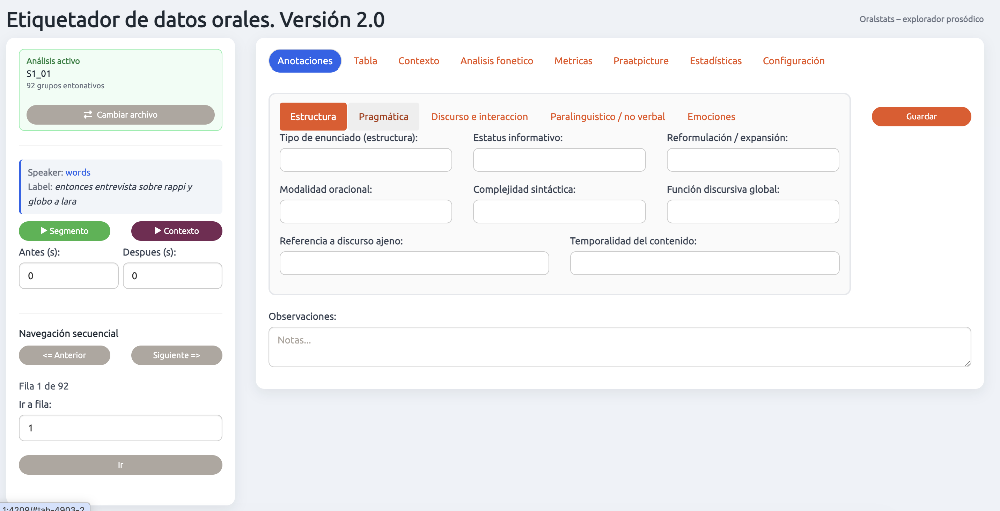 | 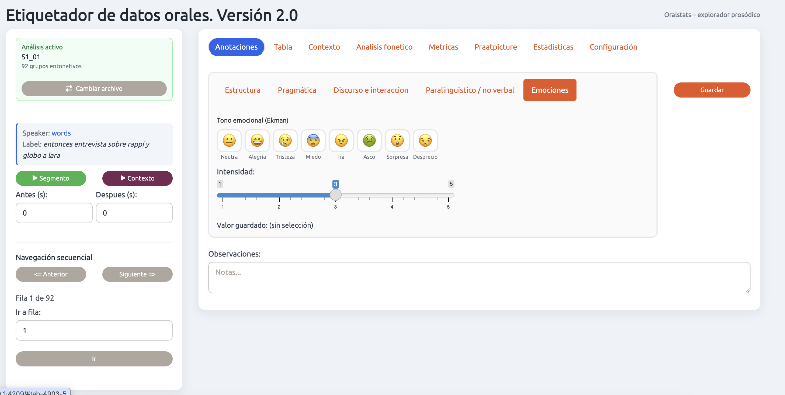 |
| **Pantalla inicial** y panel de navegación | **Anotación**: bloque de Emociones (tono de Ekman e intensidad) |
|  | 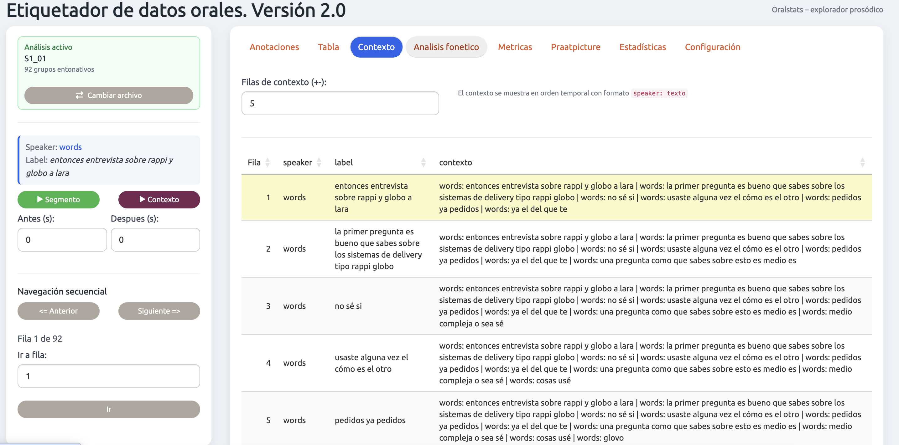 |
| **Tabla** de anotación con columna de contexto | **Contexto**: N filas anteriores y posteriores |
| 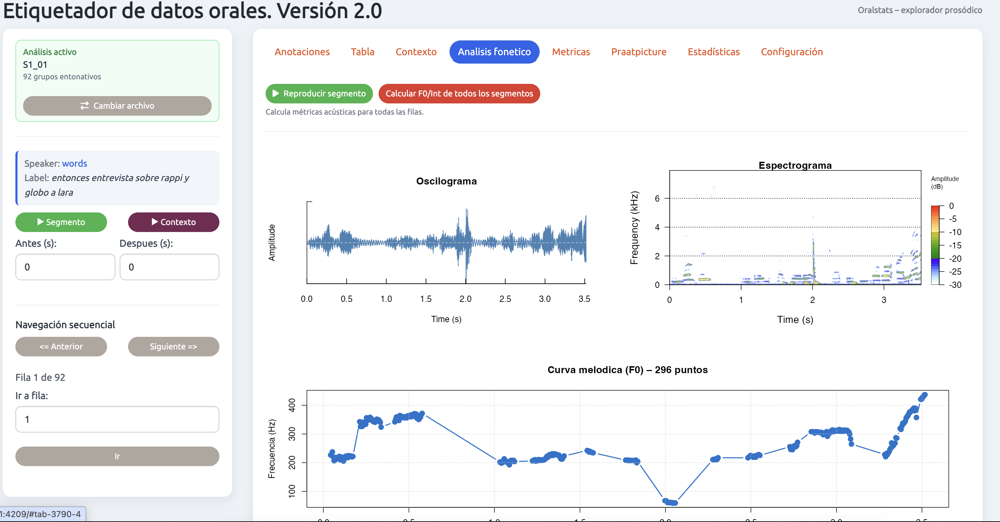 | 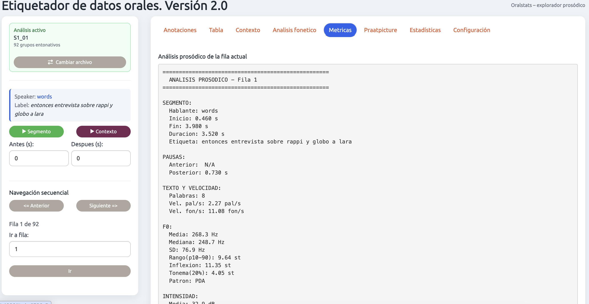 |
| **Análisis fonético**: oscilograma, espectrograma y curva F0 | **Métricas**: informe prosódico textual de la fila |
|  | 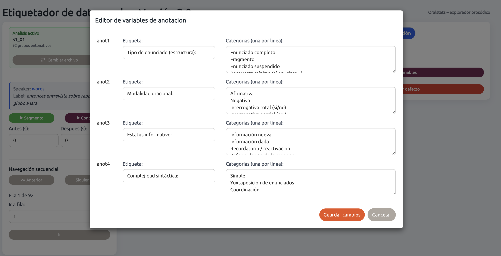 |
| **Praatpicture**: figura multipanel al estilo Praat | **Configuración**: editor de variables de anotación |
| 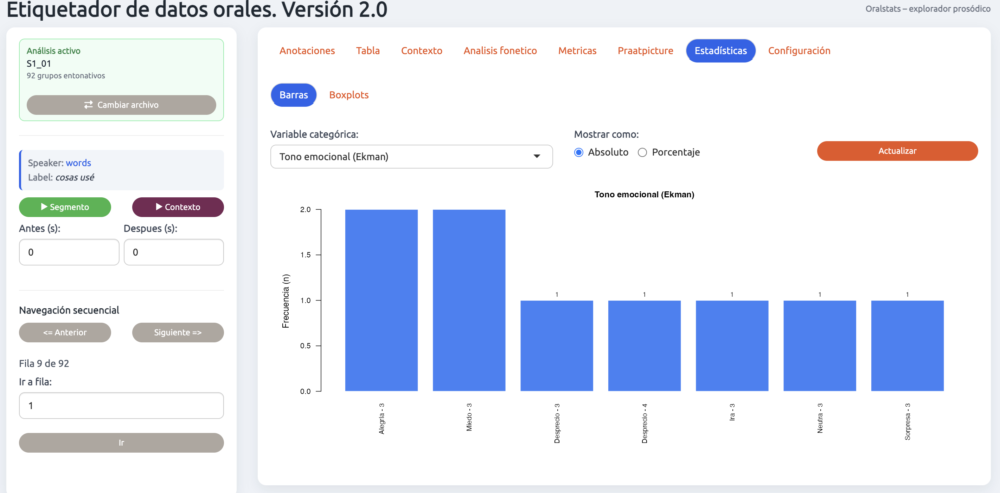 | 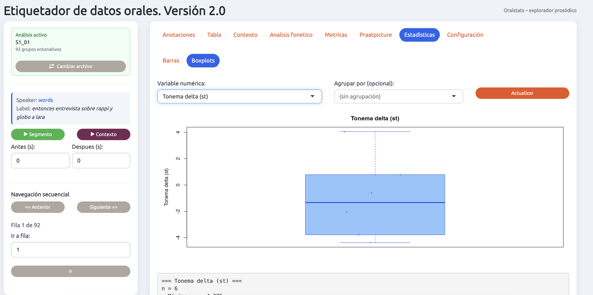 |
| **Estadísticas**: barras de una variable categórica | **Estadísticas**: boxplot de una variable numérica |

### 3. Oralstats v1.8 — "LASP" (Laboratorio de Análisis de la Señal Prosódica)

Versión modernizada de Oralstats: herramienta exploratoria que une transcripción con datos de pitch e intensidad y permite **visualizar, analizar estadísticamente y generar informes** sobre la prosodia. Interfaz `bslib` y pipeline en Python (Praat/Parselmouth para la extracción, `pysentimiento` para el sentimiento textual y emotion2vec+ para las emociones acústicas).

- **Repositorio original:** <https://github.com/acabedo/oralstats>

| | |
|---|---|
|  |  |
| **Inicio**: cargar o crear un análisis | **Resumen** del corpus (archivos, hablantes, GE, GF, palabras, vocales) |
|  |  |
| **Navegación** de grupos entonativos (AMH + ToBI) | **Configuración melódica** normalizada del grupo |
|  | 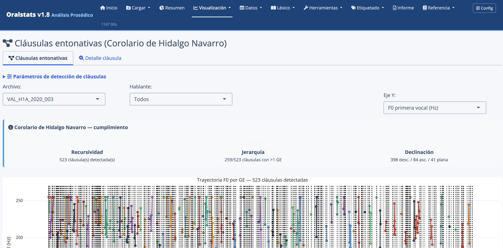 |
| **Evolución temporal** de una variable por hablante | **Cláusulas entonativas** (Corolario de Hidalgo Navarro) |
|  |  |
| **Datos**: tablas de grupos entonativos y fónicos | **Léxico**: frecuencia de palabras y diversidad (TTR) |
|  | 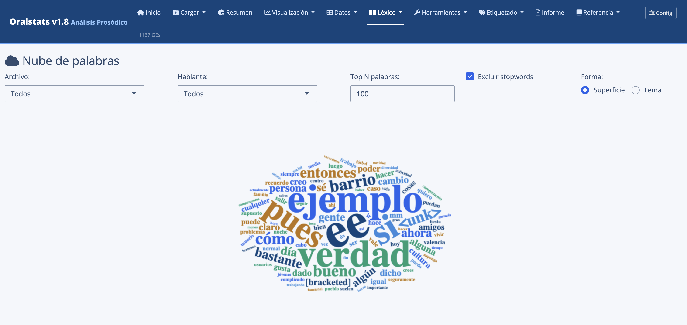 |
| **Léxico**: bigramas y trigramas | **Léxico**: nube de palabras |
|  | 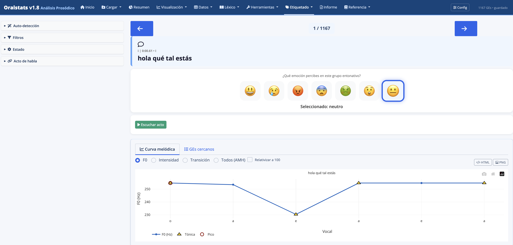 |
| **Sentimiento** textual + **emociones** acústicas | **Etiquetado emocional** manual por grupo |
|  |  |
| **Validación por jueces** (tareas de percepción) | **Generador de informes**: datos y filtros |
|  | |
| **Generador de informes**: secciones (descriptiva, ANOVA, GAMM…) | |

---

## La charla ECOS-C/N (14:30)

`presentacion/presentacion_oralstats.pdf` recoge la presentación sobre el uso de Oralstats en el marco del proyecto **ECOS-C/N**. El caso de estudio es una muestra de **18 entrevistas sociolingüísticas de PRESEEA-Valencia**, equilibrada por sexo, nivel de estudios y tramo de edad, sobre la que se ilustra todo el proceso: extracción prosódica, descripción del corpus, análisis estadístico (boxplots con test, ANOVA/Kruskal-Wallis, modelos GAMM) y generación de informes.

Las tres muestras de `samples/` son cortes representativos de ese mismo corpus, listos para reproducir el análisis en directo.

---

## Requisitos

**R ≥ 4.2** y, según la aplicación:

- **APH:** `shiny`, `plotly`, `dplyr`, `DT`, `readr` · Praat ≥ 6.4 para los `.praat`.
- **Etiquetador oral (v2.0):** `shiny`, `DT`, `tuneR`, `shinyjs`, `shinythemes`, `seewave`, `wrassp`, `praatpicture`, `tools`, `av`, `rPraat`.
- **Oralstats v1.8:** `av`, `bslib`, `data.table`, `dplyr`, `DT`, `ggeffects`, `ggfun`, `ggplot2`, `jsonlite`, `mgcv`, `plotly`, `RColorBrewer`, `seewave`, `shiny`, `shinyjs`, `tidyr`, `tuneR`, `udpipe`.

**Pipeline Python** (notebooks de Colab y módulos de Oralstats):

```bash
pip install praat-parselmouth pysentimiento torch torchaudio funasr soundfile whisperx
# MFA se instala vía conda: conda install -c conda-forge montreal-forced-aligner
```

> Los notebooks están pensados para ejecutarse en **Google Colab** (el de transcripción aprovecha la GPU; el de MFA usa CPU). El de diarización requiere un **token de Hugging Face** para `pyannote`.

---

## Cómo seguir el taller (resumen rápido)

1. Abre los notebooks de `colabnotebooks/` en Google Colab y ejecuta, en orden, la transcripción/diarización y luego la alineación + extracción prosódica. *(Opcional en directo: puedes saltar este paso y usar directamente las muestras ya procesadas de `samples/`.)*
2. Lanza cualquiera de las apps desde R:
   ```r
   shiny::runApp("aph_extractor/app.R")     # APH
   shiny::runApp("etiquetador/etiquetador_oral.R")   # Etiquetador oral
   # Primera vez (reproduce el entorno R + Python y arranca):
   Rscript Oralstats/run.R                   # Oralstats v1.8
   # (o, si ya tienes el entorno listo:)  shiny::runApp("Oralstats")
   ```
3. Carga las muestras de `samples/` (pares WAV + TextGrid) y reproduce el análisis prosódico.

La guía paso a paso está en `tutorial/guia_tubinga_2026.pdf`.

---

## Créditos y licencia

© 2026 Adrián Cabedo Nebot (Universitat de València). Materiales preparados para Tübingen 2026.

Cada aplicación mantiene la licencia de su repositorio original (ver el `LICENSE` correspondiente): APH — <https://github.com/acabedo/aph>; Etiquetador oral — <https://github.com/acabedo/scripts>; Oralstats — <https://github.com/acabedo/oralstats>.

Las muestras de audio proceden de **PRESEEA-Valencia** y se incluyen, anonimizadas y recortadas, con fines exclusivamente docentes e ilustrativos.
